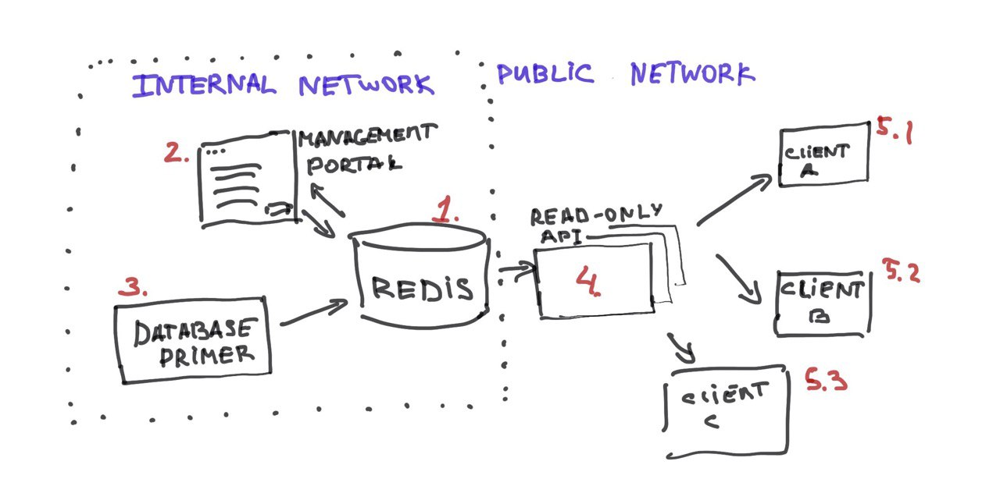
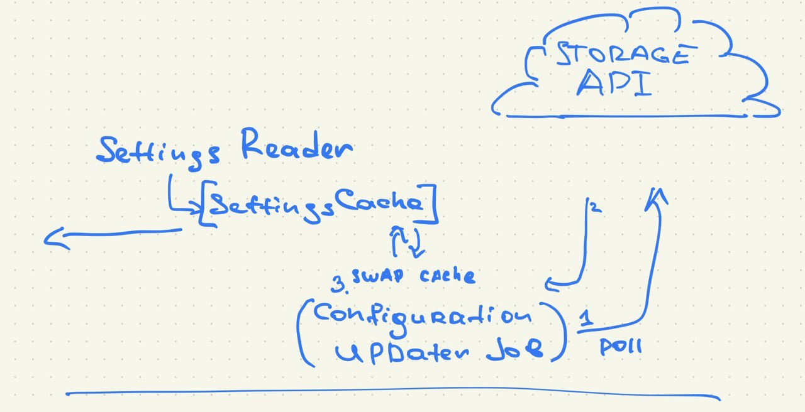
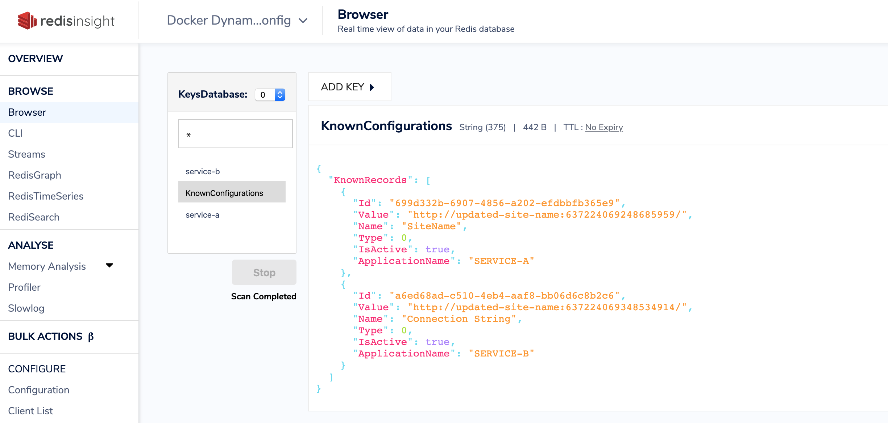
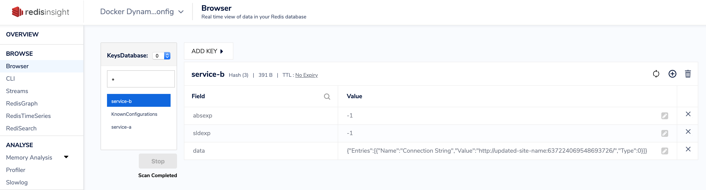

dynamic-config
====


### Project overview 

`DynamicConfig.Configuration` library aims to provide an abstraction over the configuration management system. It provides the 'hot' settings reload without a need to redeploy or restart an application.

This repository consists of a few packages: 

* `DynamicConfig.Configuration` is a client library which manages a local cache of settings for the given service
* `DynamicConfig.Storage.Api` is a .NET Core Web API project which provides an http interface for the Configuration lib. It seres and up-to-date configuration state stored in a central redis db.
* `DynamicConfig.Management.Web` is a configuration management portal, which provides standard CRUD operations to the settings set.
* `clients/DatabasePrimer.Service` a side-car service for the `DynamicConfig.Management.Web` project. It's only goal is to insert some configs, to solve the cold start problem. (for the demo purpose it just inserts some random keys/values to the db)
* `clients/WorkerService.ServiceA` is an example client application with is using the `DynamicConfig.Configuration` lib to keep its settings up to date.

### How to build/test

Make sure you have .NET Core 3.1 SDK installed.

Navigate to the repo root and run: 

```
dotnet build
dotnet test
```

and enjoy :)

### How to see it in action

Make sure you have Docker installed.

Navigate to the repo root and run: 

```
docker-compose build
docker-compose up (-d)
```

this will bring up the following system: 




There will be two networks spined up :`internal` and `public`.

In a private network you will find three services: 

1. `dynamic-config-redis-storage` a Redis service
2. `dynamic-config-management-web` a management portal which enables you to perform CRUD operations on your settings set.
3. `dynamic-config-database-primer` a service which seeds an initial data and randomly adds keys to DB

In a public network you have following services available: 

4. `dynamic-config-storage-api` a read-only api which provides clients with an up-to-date configuration. Could be scaled individually depends on the load. 
5. `client-service-a` a service which uses a `DynamicConfig.Configuration` library to access it's settings.

the management portal should be available on : 

`http://0.0.0.0:8081`

Make sure to take a look at logs (either run `docker compose up` without `-d` key, or log in to a container and check it's logs (`docker ps` `docker logs`), or use you Docker Desktop UI tool, whatever floats your boat.). You will notice how the DatabasePrimer puts new settings key to the DB, how ServiceA tries to refresh its settings and how Storage.Api services an updated keys set.


### Library overview

To use the library make sure to have it linked to your project (as a NuGet package, one day, maybe, or just as a project reference for now).

in a `Startup.cs` or whatever is the right place to configure the DI composition root for your project type use: 

```c#
services.UseDynamicConfiguration(Configuration);
```
where `Configuration` is your `IConfiguration` instance.

This will register `IConfigurationReader` as a singleton in your DI container and kick of the synchronization process.

If you're going to use the library this way you'd need to have following env vars provider (well, they don't have to be ENVVARS, but they have to be discoverable through the .NET Core configuration system via `IConfiguration` interface implementation): 

```bash
DYNAMIC_CONFIG_APPLICATION_NAME=SERVICE-A
DYNAMIC_CONFIG_REFRESH_INTERVAL_MS=10000
DYNAMIC_CONFIG_STORAGE_CONNECTION_STRING=http://dynamic-config-storage-api:80

```

alternatively you can manually create an instance of `ConfigurationReader` by providing these values as a constructor parameters: 

```c#
new ConfigurationReader("service-a", "http://connection:123", 1000);
```

Then, whenever you need an access to the config you can inject the `IConfigurationReader` and use it like that: 

```c#
var value = _configurationReader.GetValue<string>("SiteName");
```

this will return an up-to-date settings value. Keep in mind that this will be either the very fresh value (if the sync process has succeeded recently, or it will fallback to you `appsettings.json` value (or any other source depends on the config provider configured for your app and accessible via `IConfiguration`)


#### Library architecture overview



The library consists of three components. 

* Settings Reader: a public interface, providing an access to the existing SettingsCache
* SettingsCache an immutable key-value collection of known active keys for this application.
* Configuration Updater Job: a background process which periodically polls a Storage API, processed the response and swaps the SettingsCache with a new one (remember, the cache is immutable)

#### Storage structure

Redis entries managed by this application have the following structure: 



A json payload with the list of 'known configurations'. This is used by the Management portal UI. Retrieved and stored as a whole.



Settings list per service (`service-a` on the screenshot). Stored as a hash because it's managed by .NET Core `IDistributedCache` implementations.

### Q&A

> Why the odd code style? 

No practical reason, tbh. It's just a good indicator that the settings set from my `.editorconfig` was picked up by the IDE and code format action has been applied to the file. 

> Why so few tests?

The library it tested, but other systems are not covered very well, simply because I didn't have enough time.

> Why just Redis? 

This is probably not the best solution, because it makes key management a bit cumbersome. I should have split the storage into two parts: a bit more advanced storage like CosmosDB/MongoDB/MSSQL and a settings cache in Redis organized by application name.

This will allow us to have a nice table-like persisted storage, where we can perform CRURD operations. This storage won't be very loaded, because it'll be isolated from all the polling by clients.

And if we add a sync service with would detect storage modification (it could be notified by the message on the message bus), which would take care of Redis cache update (remove inactive settings, insert new settings, update existing active settings).

But that's probably too much for a weekend PoC project, right?

> Why there is no 'Create new' or 'Edit' ui and implementation in the Management portal?

Same reason as above. Not enough time.
